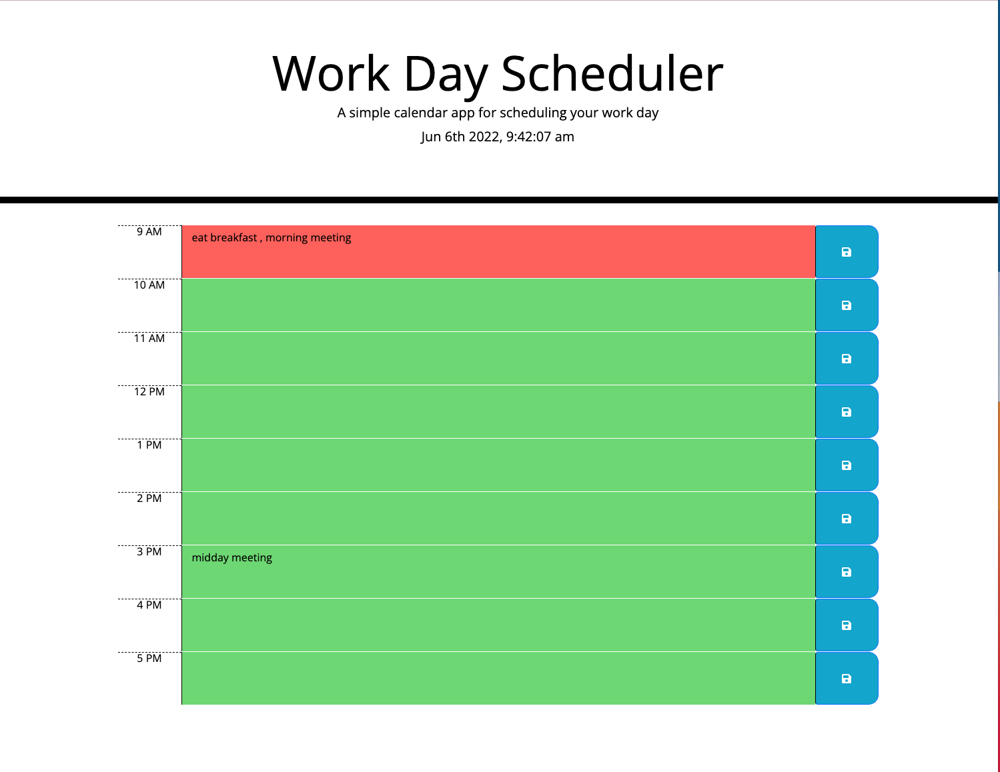

# WorkDayScheduler
For this challenge, we have been instructed to create a simple calendar application that allows a user to save evdents for each of the work day. This app runs in browser and features dynamically updated HTML and CSS powered by jQuery. This app also uses the Moment.js library to display the current date and time. The following is the challenge's acceptance criteria:

```md
GIVEN I am using a daily planner to create a schedule
WHEN I open the planner
THEN the current day is displayed at the top of the calendar
WHEN I scroll down
THEN I am presented with timeblocks for standard business hours
WHEN I view the timeblocks for that day
THEN each timeblock is color coded to indicate whether it is in the past, present, or future
WHEN I click into a timeblock
THEN I can enter an event
WHEN I click the save button for that timeblock
THEN the text for that event is saved in local storage
WHEN I refresh the page
THEN the saved events persist
```


## Link to Deployed Application 
Open the Work Day Scheduler [URL]() in your browser. 